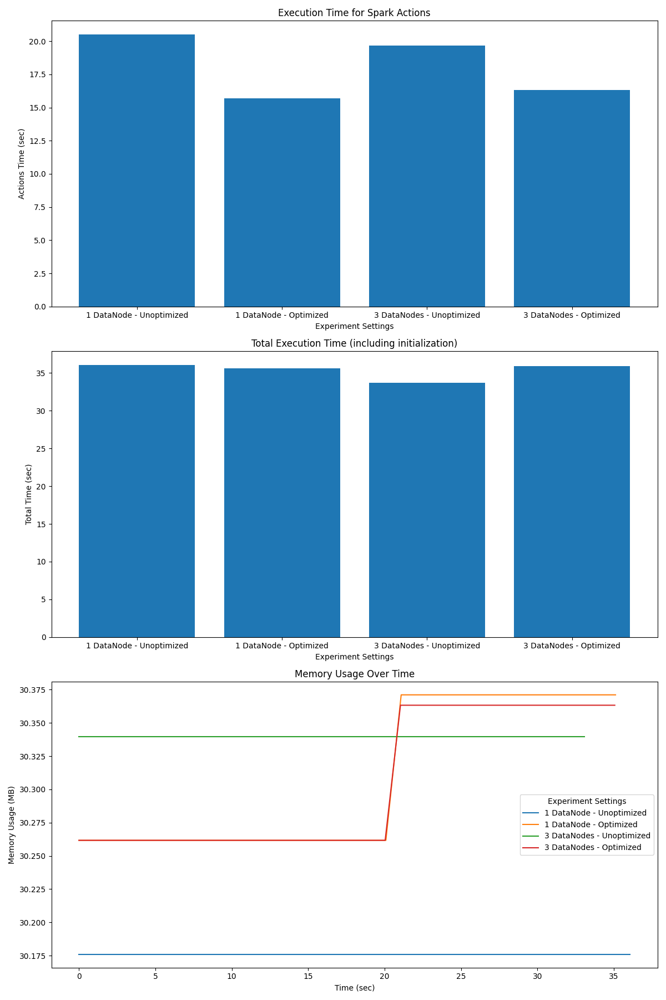

# Spark performance testing

To reproduce the performance testing, start Docker and run from the project's directory:

```bash
pip install -r requirements.txt
python main.py
```

# Resulting plot


